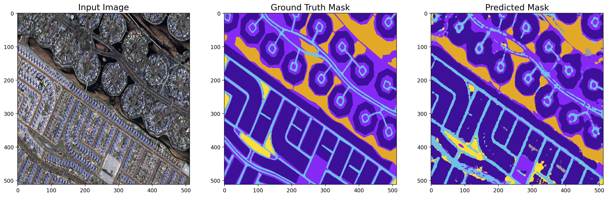

# Geospatial Object Detection using Aerial Imagery

 

## Introduction

Multi U-Net architecture has transformed aerial image object detection, pioneering advancements in geospatial analysis. This modified U-Net model excels in complex multi-class segmentation scenarios, leveraging spatial information effectively. The project employs a sophisticated image processing pipeline, maximizing deep learning model training through Min-Max scaling and Patchify techniques. It utilizes performance evaluation metrics like the Jaccard coefficient and a custom loss function hierarchy combining Focal Loss and Dice Loss for efficient model training. Results demonstrate Multi U-Net's ability to handle specific item types, reduce false positives/negatives, and adapt to diverse datasets and domains. Its improved segmentation precision benefits environmental monitoring, disaster management, and urban planning, showcasing its potential for impactful decision-making processes across various disciplines.

## Technical Stack

|&nbsp;|
&nbsp;|
&nbsp;|
&nbsp;|
&nbsp;|
&nbsp;|
&nbsp;|

## Dataset

<a href="https://humansintheloop.org/">Humans in the Loop</a> has published an open access dataset annotated for a joint project with the <a href="https://www.mbrsc.ae/">Mohammed Bin Rashid Space Center</a> in Dubai, the UAE. The dataset consists of aerial imagery of Dubai obtained by MBRSC satellites and annotated with pixel-wise semantic segmentation in 6 classes.

### Semantic Annotation

The dataset includes 72 images grouped into 8 larger tiles.
The images are labeled and contain the following classes:

| Name       | R   | G   | B   | Color                                                                                              |
| ---------- | --- | --- | --- | -------------------------------------------------------------------------------------------------- |
| Building   | 60  | 16  | 152 | 

   |
| Land       | 132 | 41  | 246 | 

       |
| Road       | 110 | 193 | 228 | 

       |
| Vegetation | 254 | 221 | 58  | 

 |
| Water      | 226 | 169 | 41  | 

      |
| Unlabeled  | 155 | 155 | 155 | 

  |

The trained models can be found <a href="https://drive.google.com/drive/folders/16IpkE45L2x0zmlykJXDDApmhDL14eFa-?usp=sharing">here.</a>

### Results

Predictions on Validation Set Images:

